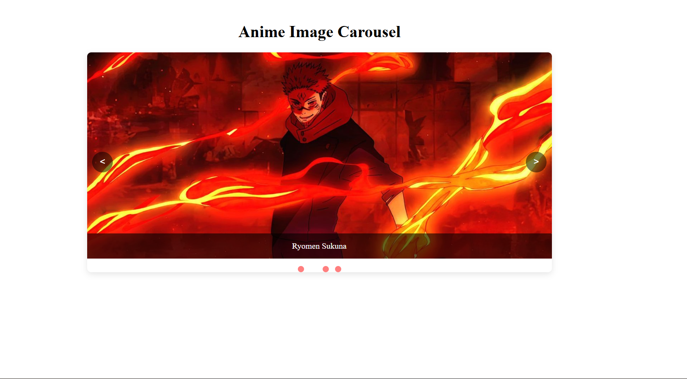
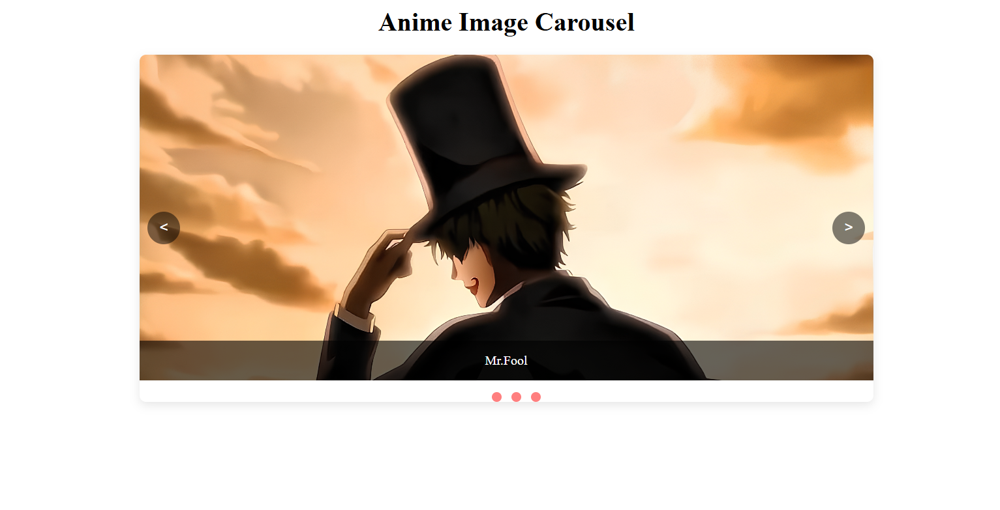

# MWAD_EX05_image-carousel-in-react
## Date:12-11-2025

## AIM
To create a Image Carousel using React 

## ALGORITHM
### STEP 1 Initial Setup:
Input: A list of images to display in the carousel.

Output: A component displaying the images with navigation controls (e.g., next/previous buttons).

### Step 2 State Management:
Use a state variable (currentIndex) to track the index of the current image displayed.

The carousel starts with the first image, so initialize currentIndex to 0.

### Step 3 Navigation Controls:
Next Image: When the "Next" button is clicked, increment currentIndex.

If currentIndex is at the end of the image list (last image), loop back to the first image using modulo:
currentIndex = (currentIndex + 1) % images.length;

Previous Image: When the "Previous" button is clicked, decrement currentIndex.

If currentIndex is at the beginning (first image), loop back to the last image:
currentIndex = (currentIndex - 1 + images.length) % images.length;

### Step 4 Displaying the Image:
The currentIndex determines which image is displayed.

Using the currentIndex, display the corresponding image from the images list.

### Step 5 Auto-Rotation:
Set an interval to automatically change the image after a set amount of time (e.g., 3 seconds).

Use setInterval to call the nextImage() function at regular intervals.

Clean up the interval when the component unmounts using clearInterval to prevent memory leaks.

## PROGRAM

### App.jsx
```

import { useState, useEffect } from 'react';
import './App.css';

const ImageCarousel = ({ images, autoPlayInterval = 3000, showControls = true }) => {
  const [currentIndex, setCurrentIndex] = useState(0);
  const [isPlaying, setIsPlaying] = useState(true);

  useEffect(() => {
    let interval;
    if (isPlaying) {
      interval = setInterval(() => {
        setCurrentIndex((prevIndex) => (prevIndex + 1) % images.length);
      }, autoPlayInterval);
    }
    return () => interval && clearInterval(interval);
  }, [isPlaying, images.length, autoPlayInterval]);

  const goToPrevious = () => {
    setCurrentIndex((prevIndex) => (prevIndex - 1 + images.length) % images.length);
  };

  const goToNext = () => {
    setCurrentIndex((prevIndex) => (prevIndex + 1) % images.length);
  };

  const goToSlide = (index) => setCurrentIndex(index);

  const togglePlayPause = () => setIsPlaying(!isPlaying);

  return (
    <div className="carousel-container">
      <div className="carousel-inner">
        {images.map((image, index) => (
          <div 
            key={index} 
            className={`carousel-item ${index === currentIndex ? 'active' : ''}`}
          >
            
            {image.caption && <div className="carousel-caption">{image.caption}</div>}
          </div>
        ))}
      </div>

      {showControls && (
        <div className="carousel-controls">
          <button className="carousel-control prev" onClick={goToPrevious}>&lt;</button>
          <button className="carousel-control play-pause" onClick={togglePlayPause}>
            {isPlaying ? '❚❚' : '▶'}
          </button>
          <button className="carousel-control next" onClick={goToNext}>&gt;</button>
        </div>
      )}

      <div className="carousel-indicators">
        {images.map((_, index) => (
          <button
            key={index}
            className={`carousel-indicator ${index === currentIndex ? 'active' : ''}`}
            onClick={() => goToSlide(index)}
          />
        ))}
      </div>
    </div>
  );
};

export default function App() {
  const images = [
    { src: "/images/Mr.Fool.png", caption: "Mr.Fool" },
    { src: "/images/Ryomen Sukuna.jpeg", caption: "Ryomen Sukuna" },
    { src: "/images/Solo leveling.jpeg", caption: "Solo Leveling" },
    { src: "/images/Satoru Gojo.jpg", caption: "Satoru Gojo" },

  ];

  return (
    <div className="page-container">
      <h1>Anime Image Carousel</h1>
      <div className="carousel-wrapper">
        <ImageCarousel
          images={images}
          autoPlayInterval={2500}
          showControls={true}
        />
      </div>
    </div>
  );

}


```

### App.css
```

.carousel-container {
  position: relative;
  width: 100%;
  max-width: 900px;
  margin: 0 auto;     
  overflow: hidden;
  border-radius: 8px;
  box-shadow: 0 4px 12px rgba(0, 0, 0, 0.1);
}

.carousel-inner {
  position: relative;
  width: 100%;
  height: 400px;
}

.carousel-item {
  position: absolute;
  top: 0;
  left: 0;
  width: 100%;
  height: 100%;
  opacity: 0;
  transition: opacity 0.5s ease-in-out;
  display: flex;
  align-items: center;
  justify-content: center;
}

.carousel-item.active {
  opacity: 1;
  z-index: 1;
}

.carousel-item img {
  width: 100%;
  height: 100%;
  object-fit: cover;
}

.carousel-caption {
  position: absolute;
  bottom: 0;
  left: 0;
  right: 0;
  background-color: rgba(0, 0, 0, 0.6);
  color: white;
  padding: 15px;
  text-align: center;
}

/* Controls */
.carousel-controls {
  position: absolute;
  top: 50%;
  width: 100%;
  display: flex;
  justify-content: space-between;
  z-index: 2;
  transform: translateY(-50%);
}

.carousel-control {
  background-color: rgba(0, 0, 0, 0.5);
  color: white;
  border: none;
  width: 40px;
  height: 40px;
  border-radius: 50%;
  cursor: pointer;
  display: flex;
  align-items: center;
  justify-content: center;
  font-size: 18px;
  transition: background-color 0.3s;
}

.carousel-control:hover {
  background-color: rgba(0, 0, 0, 0.8);
}

.carousel-control.prev {
  margin-left: 10px;
}

.carousel-control.next {
  margin-right: 10px;
}

.carousel-control.play-pause {
  position: absolute;
  left: 50%;
  transform: translateX(-50%);
  font-size: 14px;
}

/* Indicators */
.carousel-indicators {
  position: static;      
  margin-top: 15px;      
  display: flex;
  justify-content: center;
  gap: 12px;
}

.carousel-indicator {
  width: 12px;
  height: 12px;
  border-radius: 50%;
  background-color: rgba(255, 0, 0, 0.5);
  border: none;
  cursor: pointer;
  transition: background-color 0.3s;
}

.carousel-indicator:hover {
  background-color: rgba(255, 255, 255, 0.8);
}

.carousel-indicator.active {
  background-color: white;
}

.page-container {
  text-align: center;
  padding: 20px;
}

.carousel-wrapper {
  justify-content: center;
  width: 100%;
}


```

## OUTPUT






## RESULT
The program for creating Image Carousel using React is executed successfully.
